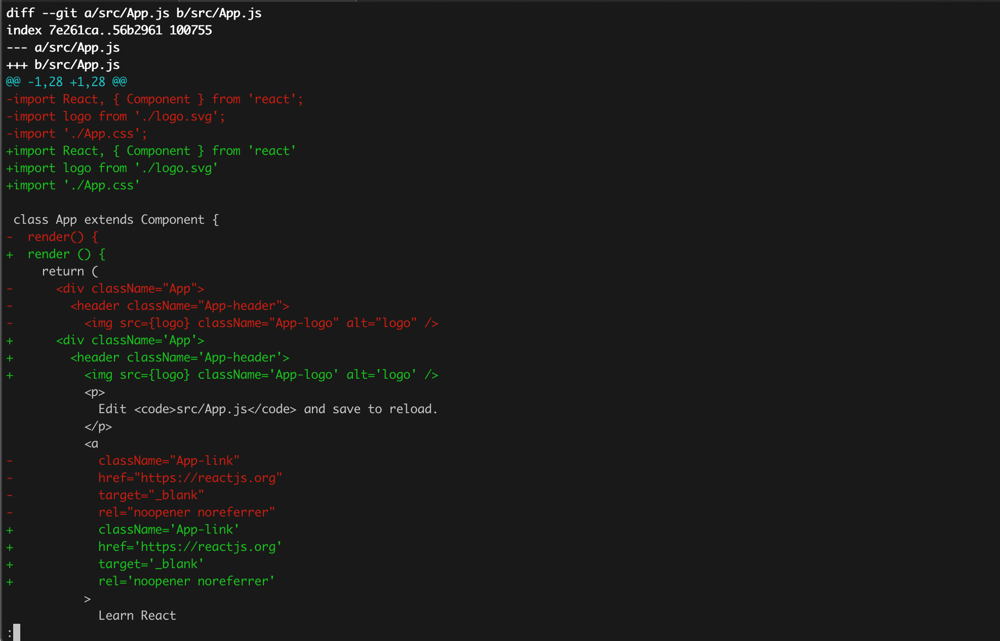

## How to enforce consistent code style throughout your create-react-app project without tears.

I've been using create-react-app for a lot of projects and I always faced with the same problem: eslint integration.

Create-react-app eslint configuration is not about code style. They show lint violations that can imply errors in the program.

Add eslint as a direct dependency always carries with some warning issues by react-scripts or npm.
In fact, if you don't match your eslint version with the CRA eslint version, you will see an error like this:

```bash
There might be a problem with the project dependency tree.
It is likely not a bug in Create React App, but something you need to fix locally.
```

## Standard as solution

After some research, I've found recommendations about [JavaScript Standard Style](https://standardjs.com/).

They have eslint as a dependency, but they manage all for us and style and rules are good enough.
You can read more about their style and rules in their website.


## Let's code!

To get started create a create-react-app project
```bash
npx create-react-app react-with-style
cd react-with-style
```

Add the package we are talking about:
```
npm install standard --save-dev

```

Add some basic configuration
We will ignore the build folder and declare some environment variables for Jest testing:
```json
{
  ...
  "scripts": {
    ...
    "lint": "standard",
    "lint-fix": "standard --fix"
  },
  "standard": {
    "ignore": [
      "build/*"
    ],
    "env": [
      "jest",
      "es6",
      "browser"
    ]
  },
  "devDependencies": {
    "standard": "^12.0.1"
  }
  ...
}
```

Now we can run the linter! Let's see the firsts errors:
```bash
npm run lint
```

Actually, we can fix them automatically:
```bash
npm run lint-fix
```

Now we don't have any error! We can see the changes made by the linter running a diff:

```bash
git diff src
```



## Slow adoption

Running a fix over in the whole project is okay if you're working alone. But if you're in a big project apply changes over all the files will carry a lot of merge conflicts.
It's a better idea to start small and apply the lint over the last changes.
In git user words, we need to apply lint over staged git files.

### We achieve this by adding these two dependencies:

- [lint-staged](https://github.com/okonet/lint-staged): allows to run tasks against staged git files.
- [husky](https://github.com/typicode/husky): allows to configure hooks.

Let's install them:
```
npm i --save-dev lint-staged husky
```

We have to update our package.json to configure this packages

```json
  "husky": {
    "hooks": {
      "pre-commit": "lint-staged"
    }
  },
  "lint-staged": {
    "*.js": [
      "npm run lint-fix",
      "git add"
    ]
  },
```

## Making work the hooks

Now we can commit and husky will run the lint over the edited files.

```bash
$ git commit -am "test"                                                                                                    [18:52:02]
husky > pre-commit (node v11.3.0)
  ↓ Stashing changes... [skipped]
    → No partially staged files found...
  ✔ Running linters...
[master fae5433] test
 2 files changed, 38 insertions(+), 1 deletion(-)
```

If we declare a unused variable and try to commit we will see this:

```bash
$ git commit -am "test"                                                                                                    [18:53:49]
husky > pre-commit (node v11.3.0)
  ↓ Stashing changes... [skipped]
    → No partially staged files found...
  ❯ Running linters...
    ❯ Running tasks for *.js
      ✖ npm run lint-fix
        git add

✖ npm run lint-fix found some errors. Please fix them and try committing again.

> react-with-style@0.1.0 lint-fix /Users/facundo/Documents/code/react-with-style
> standard --fix "/Users/facundo/Documents/code/react-with-style/src/App.js"

react-with-style/src/App.js:5:5: 'x' is defined but never used.
```


## Final configuration

The final package.json should looks like this:

```json
{
  "name": "react-with-style",
  "version": "0.1.0",
  "private": true,
  "dependencies": {
    "react": "^16.7.0",
    "react-dom": "^16.7.0",
    "react-scripts": "2.1.3"
  },
  "scripts": {
    "start": "react-scripts start",
    "build": "react-scripts build",
    "test": "react-scripts test",
    "eject": "react-scripts eject",
    "lint": "standard",
    "lint-fix": "standard --fix"
  },
  "husky": {
    "hooks": {
      "pre-commit": "lint-staged"
    }
  },
  "lint-staged": {
    "*.js": [
      "npm run lint-fix",
      "git add"
    ]
  },
  "standard": {
    "ignore": [
      "build/*"
    ],
    "env": [
      "jest",
      "es6",
      "browser"
    ]
  },
  "eslintConfig": {
    "extends": "react-app"
  },
  "browserslist": [
    ">0.2%",
    "not dead",
    "not ie <= 11",
    "not op_mini all"
  ],
  "devDependencies": {
    "husky": "^1.3.1",
    "lint-staged": "^8.1.0",
    "standard": "^12.0.1"
  }
}
```

### Links
- [Create React App](https://facebook.github.io/create-react-app/)
- [JavaScript Standard Style](https://standardjs.com/)
- [Lint Staged](https://github.com/okonet/lint-staged)
- [Husky](https://github.com/typicode/husky)


